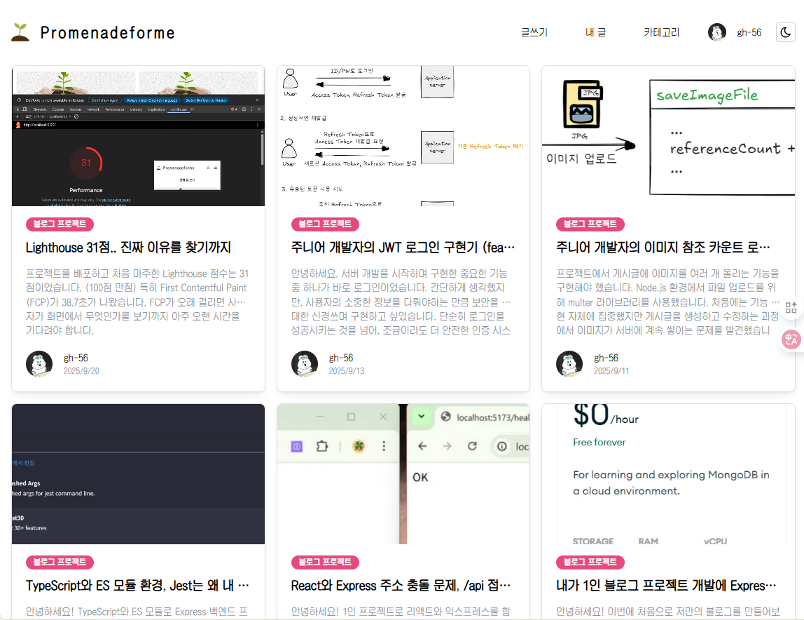
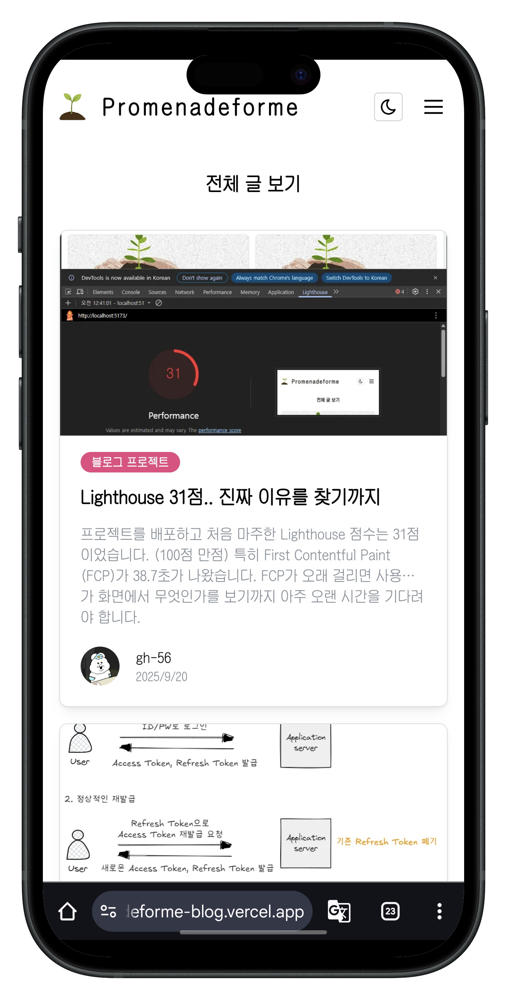
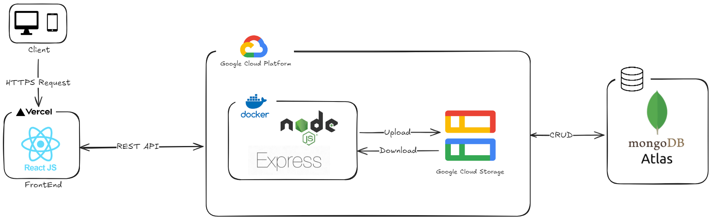

# **Promenadeforme: 나를 위한 산책**

> **풀스택 개발 전 과정을 학습하기 위해 진행한 블로그 프로젝트입니다.**

 

  
  

  <a href="https://promenadeforme-blog.vercel.app"><strong>🌐 WebSite</strong></a>
  &nbsp;&nbsp;&nbsp;|&nbsp;&nbsp;&nbsp;
  <a href="https://promenadeforme.kro.kr/api-docs/"><strong>📚 API Docs</strong></a>

    
    
    
    

---

## 🏛️ 1. 프로젝트 아키텍처

본 프로젝트는 개발자로서의 성장 과정을 기록하고, 학습한 기술을 공유하기 위해 직접 구현한 블로그입니다.  
한 번의 기능 구현으로 끝나는 프로젝트가 아닌, 지속적인 유지보수와 안정적인 배포가 가능한 살아있는 서비스를 구축하는 것을 목표로 설계했습니다.

 

#### **시스템 아키텍처**

 

#### **해당 기술들을 사용한 이유**

- **TypeScript**: 런타임 에러를 사전에 방지하고, 코드의 안정성을 높여 견고한 애플리케이션을 구축하기 위해 도입했습니다.

- **React**:
  - 가장 익숙한 기술을 선택하여 핵심 기능 구현에 집중하는 동시에, 프로젝트 완주 경험을 통해 기술 숙련도를 한 단계 높이는 것을 목표로 했습니다.
  - Virtual DOM을 활용한 빠른 렌더링 속도는 사용자에게 쾌적한 인터페이스를 제공하는 데 가장 적합하다고 판단했습니다.

- **Node.js (Express)**: 글쓰기, 읽기 등 핵심 CRUD 기능에 집중한 이번 프로젝트의 규모에 가장 적절한 도구였다고 생각합니다. 프론트엔드와 백엔드에서 모두 같은 언어를 사용하여 개발 생산성을 높였습니다.

- **MongoDB**:
  - 프로젝트 초기 단계에서 데이터 구조가 변경될 가능성을 고려하여, 스키마 변경에 유연하게 대처할 수 있는 Document 기반의 NoSQL 데이터베이스를 선택했습니다.
  - 비용 부담이 없는 Atlas의 무료 서비스로 해결할 수 있다는 점 또한 매력적이어서 선택했습니다.

- **GCP**: 기존에 사용하던 AWS와 Azure의 무료 크레딧이 소진된 후, 대안으로 Oracle Cloud 가입을 시도했으나 실패하여 최종적으로 GCP를 선택하게 되었습니다.

## ✨ 2. 주요 기능 및 구현 기술

- **주요 기능 1: 사용자 인증 시스템**
  - **구현 내용:** JWT(Access/Refresh Token) 기반 로그인/로그아웃
  - **적용 기술:** `Bcrypt`를 이용한 비밀번호 암호화, Refresh Token Rotation 전략을 통한 보안 강화
- **주요 기능 2: CRUD 게시판**
  - **구현 내용**:
    - 게시글 작성/조회/수정/삭제, 이미지 업로드, 카테고리 시스템
    - `Tiptap` 에디터를 활용한 위지윅(WYSIWYG) 글쓰기 환경 제공
  - **적용 기술**:
    - `RESTful API` 설계 원칙 준수
    - `Multer`와 `Google Cloud Storage`를 연동한 파일 관리
    - `Swagger`를 이용한 API 명세서 작성 및 관리

- **주요 기능 3: UI/UX 및 코드 품질 관리**
  - **구현 내용:**
    - `Mantine` UI 라이브러리를 활용한 반응형 디자인 및 컴포넌트 기반 UI 개발
    - `Jest`를 사용하여 핵심 로직에 대한 단위 테스트를 진행하여 코드의 안정성 확보

 

## 🚀 3. 성능 개선 및 최적화

다음과 같은 성능 최적화를 진행했습니다.

| p 최적화 항목           | Before | After      | 개선 효과       |
| ----------------------- | ------ | ---------- | --------------- |
| **Lighthouse Score**    | 55점   | **66점**   | **20% 향상**    |
| **초기 로딩 속도(FCP)** | 14.4s  | **1.8s**   | **12.6s 감소**  |
| **이미지 용량**         | 311 kB | **113 kB** | **63.67% 감소** |

- **코드 스플리팅:** `React.lazy`와 `Suspense`를 활용하여 라우트 기반으로 코드를 분할하였습니다.
- **이미지 최적화:** 서버에서 `sharp.js` 라이브러리를 통해 이미지를 리사이징하고 `WebP` 포맷으로 변환하여 사용자에게 전송합니다.

 

## 🔧 4. 주요 트러블슈팅 경험

> #### **초기 로딩 속도 14.4초 → 1.8초 개선기**

- **문제 상황:** 사용자가 첫 화면을 보기까지 FCP **14.4초**라는 극심한 지연 발생
- **원인 분석:**
  1. [초기 가설 실패] 이미지 최적화(WebP) 했으나 해결되진 않음
  2. [진짜 원인 발견] 인증 API가 Main Thread를 블로킹하여, 인증이 필요 없는 페이지조차 렌더링을 지연시킴.
- **해결 과정:** Protected Route 패턴을 도입하여 사용자 인증 로직과 UI 렌더링 분리, React.lazy & Suspense로 코드 분할 점진적 로딩 적용
- **결과 및 배운 점:** FCP: 14.4초 → 1.8초 (12.6초 감소), 하지만 여전히 느린 LCP(14.9초) => SSR (Next.js) 도입 검토

## 🌱 5. 프로젝트 성장 로드맵

본 프로젝트는 여기서 멈추지 않고, 다음과 같은 방향으로 성장하고자 합니다.

- **SSR(서버 사이드 렌더링) 도입을 통한 성능 최적화**
  - Next.js를 도입하여 현재 SPA 환경의 단점인 초기 로딩 속도(LCP) 지연 문제를 해결할 예정입니다. 이를 통해 사용자 경험(UX)을 개선하고, 검색 엔진 최적화(SEO) 효과까지 확보할 수 있을 것으로 기대합니다.

- **CI/CD 파이프라인 구축을 통한 개발 및 배포 자동화**
  - GitHub Actions를 활용해 테스트, 빌드, 배포 과정을 자동화하는 CI/CD 파이프라인을 구축할 계획입니다. 나아가 Kubernetes 환경 도입을 검토하여, 무중단 배포와 서비스 확장성을 확보해 나가는 것을 장기적인 목표로 삼고 있습니다.

- **실시간 기능 강화를 통한 사용자 상호작용**
  - WebSocket을 도입하여, 내 게시글에 새로운 댓글이나 '좋아요'가 달렸을 때 사용자에게 실시간 알림을 제공하는 기능을 구현할 것입니다. 이를 통해 서비스의 동적인 사용성을 한층 더 높일 수 있을 것으로 예상합니다.

 
